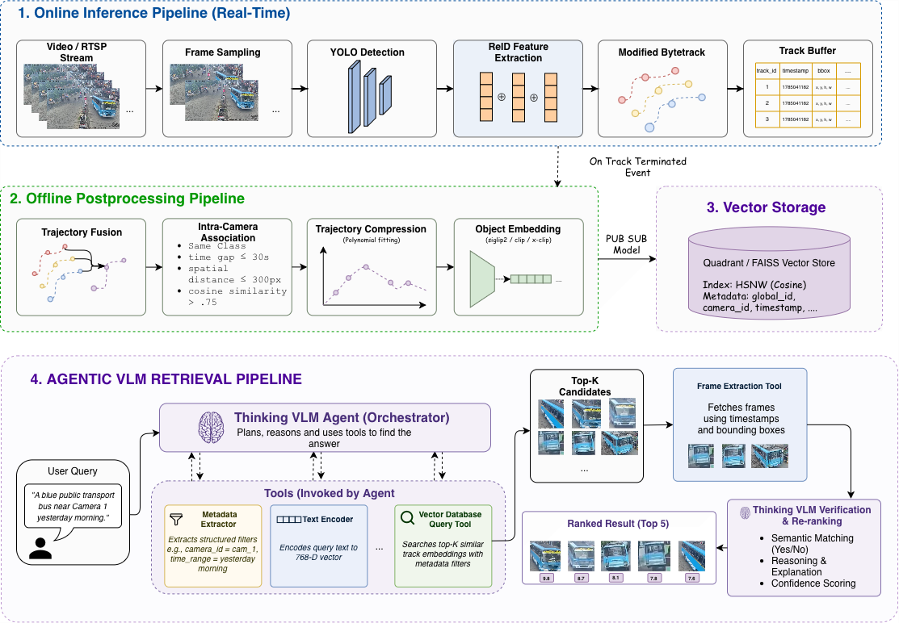
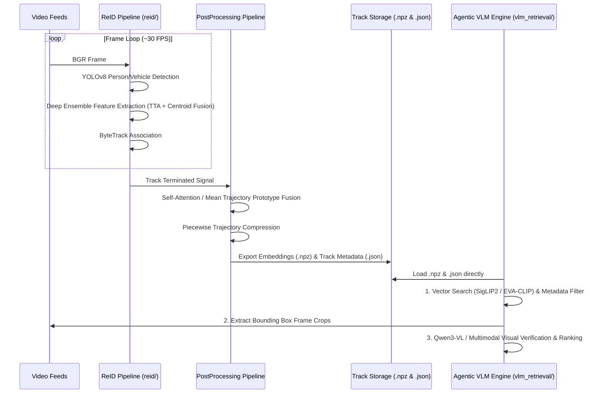

# Multi-Camera Tracking & Agentic VLM Retrieval Engine

A modular, high-performance CCTV analytics system designed for **Multi-Target Multi-Camera (MTMC) tracking**, cross-camera person/vehicle re-identification (ReID), and **Agentic VLM Retrieval**.

The system decouples video processing from multimodal search:
1. **Core ReID Engine ([`reid/`](./reid/))**: Processes raw video streams, extracts deep feature ensembles, tracks targets, and performs trajectory post-processing (self-attention fusion & piecewise compression). The interface to downstream retrieval consists of identity embeddings (`.npz`) and track metadata (`.json`).
2. **Agentic VLM Retrieval Engine ([`vlm_retrieval/`](./vlm_retrieval/))**: Direct file-based natural language search and visual reasoning engine over track embeddings and metadata using perception tools and Vision-Language Models (**Qwen3-VL-8B**, OpenAI, or Gemini).

---

## System Architecture



### Data Flow



---

## Component Overview

| Component | Description | Technologies |
|-----------|-------------|--------------|
| **Core ReID Engine (`reid/`)** | Frame ingestion, YOLOv8 detection, deep ensemble feature extraction, ByteTrack tracking, and track buffering | PyTorch, YOLOv8, ResNet101-IBN-a + ResNeXt101-IBN-a ensemble, ByteTrack |
| **Track Post-Processing (`reid/postprocessing/`)** | Trajectory prototype fusion (self-attention dot-product / mean) & piecewise polynomial compression | Scaled dot-product self-attention, polynomial interpolation |
| **Agentic VLM Engine (`vlm_retrieval/`)** | Standalone tool-assisted perception and visual reasoning search over track embeddings and metadata | Qwen3-VL-8B (on-device HF), SigLIP2, OpenAI, Gemini |
| **Shared Utilities (`shared/`)** | Common data schemas and logging utilities | Pydantic, Python |

---

## Agentic VLM Retrieval Engine ([`vlm_retrieval/`](./vlm_retrieval/))

The `vlm_retrieval/` module provides a tool-driven perception and visual reasoning search over track embeddings (`.npz`) and metadata (`.json`):

1. **Perception Tools ([`vlm_retrieval/tools.py`](./vlm_retrieval/tools.py))**:
   - `encode_and_search_vector_store`: Performs embedding similarity search against NPZ records using SigLIP2 text/image encoders.
   - `query_metadata`: Filters track events by camera ID, timestamp range, target class, or vehicle/person color attributes.
   - `extract_frame_crop`: Extracts video frames and bounding box crops from CCTV feeds.
   - `inspect_visual_candidate`: Passes candidate crops to the VLM vision engine for multi-turn visual attribute verification.

2. **Supported VLM Reasoners ([`vlm_retrieval/vqa/`](./vlm_retrieval/vqa/))**:
   - **On-Device Hugging Face**: `Qwen/Qwen3-VL-8B-Instruct` ([`Qwen3VLAgenticReasoner`](./vlm_retrieval/vqa/qwen_reasoner.py)).
   - **OpenAI API**: `openai-5.6`, `gpt-4o`, `gpt-4.5` ([`OpenAIAgenticReasoner`](./vlm_retrieval/vqa/openai_reasoner.py)).
   - **Gemini API**: `gemini-2.5-flash`, `gemini-2.5-pro` ([`GeminiAgenticReasoner`](./vlm_retrieval/vqa/gemini_reasoner.py)).

---

## Quick Start

### 1. Clone and Install Dependencies

```bash
git clone https://github.com/arjunmnath/cctv.git
cd cctv
poetry install
```

### 2. Run ReID Pipeline on Video Feeds

Process video streams to produce track embeddings (`registry.embeddings.npz`) and track metadata (`registry.tracks.json`):

```bash
poetry run python scripts/run_reid_pipeline.py \
  --video1 dataset/test/S06/c041/vdo.avi \
  --video2 dataset/test/S06/c042/vdo.avi \
  --output registry.tracks.json \
  --fusion-mode attention \
  --device auto
```

### 3. Query Agentic VLM Retrieval Engine

Execute natural language queries over the generated embeddings and metadata:

```bash
# Single Query Execution with Qwen3-VL (On-Device)
poetry run python -m vlm_retrieval.main \
  --query "find a red car on cam_1" \
  --npz_path registry.embeddings.npz \
  --json_path registry.tracks.json \
  --reasoning_model Qwen/Qwen3-VL-8B-Instruct

# Interactive CLI Query Loop
poetry run python -m vlm_retrieval.main \
  --npz_path registry.embeddings.npz \
  --json_path registry.tracks.json \
  --reasoning_model Qwen/Qwen3-VL-8B-Instruct
```

---

## Evaluation & Benchmarking

Evaluate end-to-end tracking and ReID performance (**Rank-1**, **mAP**, **mINP**, **IDF1**, **HOTA**, **DetA**, **AssA**) against ground truth annotations on **Scene 6 (`dataset/test/S06`)**:

```bash
PYTHONPATH=. poetry run python scripts/evaluate_system.py --device auto
```

---

## License

MIT
