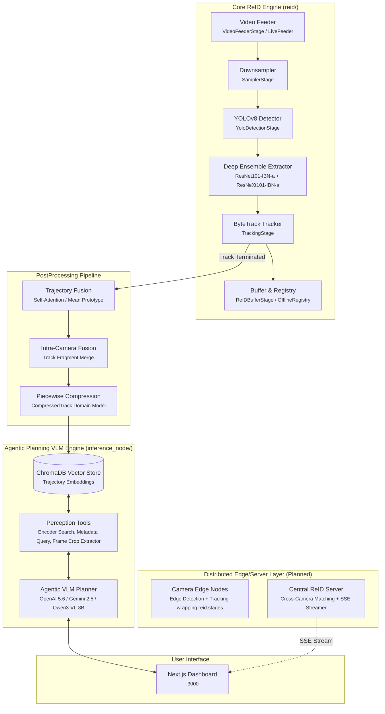
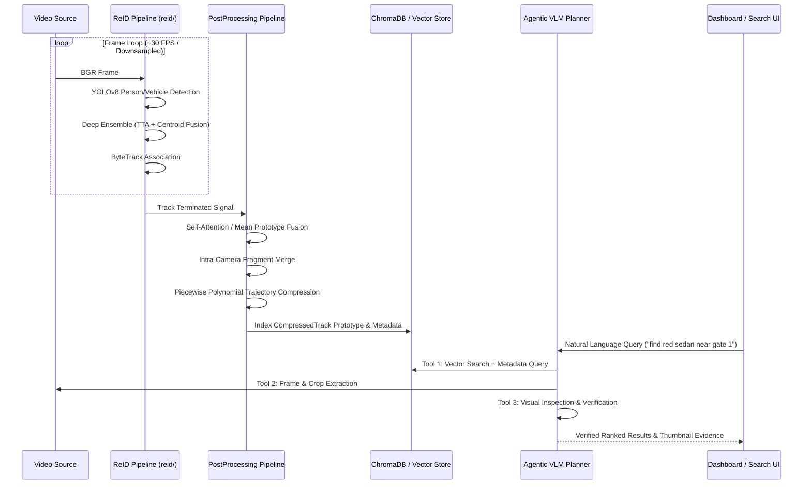

# Distributed Multi-Camera Tracking & Analytics

A real-time, modular CCTV analytics system designed for **Multi-Target Multi-Camera (MTMC) tracking** and cross-camera person/vehicle re-identification. Built around a high-performance Python ReID engine ([reid/](./reid/)), the system combines deep feature extraction ensembles, spatio-temporal tracking, track trajectory post-processing (self-attention fusion & piecewise compression), vector database integration ([ChromaDB](https://www.trychroma.com/)), and an **Agentic Planning VLM system** ([inference_node/](./inference_node/)).

## Architecture



### Data Flow



## Components

| Component | Role | Stack / Details |
|-----------|------|-----------------|
| **Core ReID Package (`reid/`)** | Frame processing pipeline, detection, ensemble feature extraction, tracking & track buffering | YOLOv8, ResNet101-IBN-a + ResNeXt101-IBN-a ensemble, ByteTrack, PyTorch |
| **Track Post-Processing (`reid/postprocessing/`)** | Trajectory prototype fusion (self-attention / mean) & piecewise compression | PyTorch scaled dot-product attention, polynomial interpolation |
| **Agentic VLM Node (`inference_node/`)** | Multistage tool-assisted planning, vector/metadata search, and visual inspection | OpenAI 5.6, Gemini 2.5/1.5, Qwen3-VL-8B (on-device HF), FastAPI |
| **Camera Edge Node** *(Planned)* | Distributed edge camera processing node wrapping `reid/` stages | Python / OpenCV / PyZMQ edge publisher |
| **Central ReID Server** *(Planned)* | Distributed cross-camera identity resolution & SSE streaming wrapping `reid/` registry | PyZMQ SUB, FastAPI SSE streamer |
| **Dashboard (`dashboard/`)** | Real-time tracking visualization & interactive retrieval UI | Next.js 14, Tailwind CSS, Framer Motion |

### Agentic Planning VLM Engine ([inference_node/](./inference_node/))

The `inference_node/` module implements an **Agentic Planning VLM system** that replaces single-step document retrieval with multistage tool-driven perception and visual reasoning:

1. **Perception & Retrieval Tools ([`inference_node/tools.py`](./inference_node/tools.py))**:
   - `encode_and_search_vector_store`: Performs embedding similarity search against ChromaDB using SigLIP-2 text/image encoders.
   - `query_metadata`: Filters track events by camera ID, timestamp range, target class, or vehicle/person color.
   - `extract_frame_crop`: Extracts full video frames and bounding box crops from CCTV video feeds.
   - `inspect_visual_candidate`: Passes candidate crops to the VLM vision engine for multi-turn visual attribute verification.
2. **Supported Agentic VLM Reasoners ([`inference_node/vqa/`](./inference_node/vqa/))**:
   - **OpenAI API**: `openai-5.6`, `gpt-4o`, `gpt-4.5` ([`OpenAIAgenticReasoner`](./inference_node/vqa/openai_reasoner.py)).
   - **Gemini API**: `gemini-2.5-flash`, `gemini-2.5-pro`, `gemini-1.5-pro` ([`GeminiAgenticReasoner`](./inference_node/vqa/gemini_reasoner.py)).
   - **On-Device Hugging Face**: `Qwen/Qwen3-VL-8B-Instruct` ([`Qwen3VLAgenticReasoner`](./inference_node/vqa/qwen_reasoner.py)).

## Prerequisites

- **Python 3.10+** with [Poetry](https://python-poetry.org/) package manager
- **Node.js 18+** and npm (for the dashboard UI)
- CUDA-capable GPU (recommended for deep ReID ensemble extraction & on-device Qwen3-VL inference)

## Quick Start

### 1. Clone and Install Dependencies

```bash
git clone https://github.com/arjunmnath/cctv.git
cd cctv
poetry install
```

### 2. Run ReID Pipeline on Video Streams

```bash
poetry run python scripts/run_reid_pipeline.py \
  --video1 dataset/test/S06/c041/vdo.avi \
  --video2 dataset/test/S06/c042/vdo.avi \
  --output artifacts/results.json \
  --fusion-mode attention \
  --device auto
```

### 3. Launch Agentic Planning VLM Inference Node

Start the agentic inference server with your preferred reasoning backend:

```bash
# Option A: Using OpenAI 5.6 / GPT-4o over API
export OPENAI_API_KEY="your-api-key"
poetry run python -m inference_node.main --reasoning_model openai-5.6

# Option B: Using Gemini 2.5-Flash over API
export GEMINI_API_KEY="your-api-key"
poetry run python -m inference_node.main --reasoning_model gemini-2.5-flash

# Option C: On-Device inference using Qwen3-VL-8B-Instruct via Hugging Face
poetry run python -m inference_node.main --reasoning_model Qwen/Qwen3-VL-8B-Instruct --device auto
```

### 4. Query Agentic VLM Node

Query the API at `http://localhost:8100/query`:

```bash
curl -X POST http://localhost:8100/query \
  -H "Content-Type: application/json" \
  -d '{"query": "find a red car that appeared on cam_1", "top_k": 5}'
```

### 5. Launch Dashboard UI

```bash
cd dashboard
npm install
npm run dev
```

Open **http://localhost:3000** to view the interactive tracking and agentic search dashboard.

## System Evaluation & Benchmarking

Evaluate end-to-end tracking and ReID performance (**Rank-1**, **mAP**, **mINP**, **IDF1**, **HOTA**, **DetA**, **AssA**) against ground truth annotations on **Scene 6 (`dataset/test/S06`)**:

```bash
PYTHONPATH=. poetry run python scripts/evaluate_system.py --device auto
```

## License

MIT
